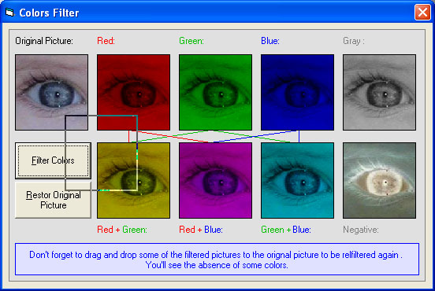



## Colors Filtering \[Basic ideas about colors\]

### Description

Basically this program filters the main three colors in a picture ( Red, Green, and Blue ), and redraws the picture in differnet combinations of those colors. This program increase your knowledge about colors, explains how the RGB function works, and show you how you filter colors. It also deals with the process of Drag Drop where you can drag and drop the filtered pictures on to the original picture so that that they get reflitered again. In that case, you'll see the absence of some colors. To make the program faster, I used API funtions (GetPixel and SetPixel). I hope the math in this example is easy to understand, if not, please feel free to conatact me. I'll be more than happy to help. If you like this program, please rate it. Good luck guys.
 
### More Info
 

             |
---                |---
**Submitted On**   |2003-08-30 17:00:56
**By**             |[Yehia Muhsen](https://github.com/Planet-Source-Code/PSCIndex/blob/master/ByAuthor/yehia-muhsen.md)
**Level**          |Beginner
**User Rating**    |5.0 (15 globes from 3 users)
**Compatibility**  |VB 5\.0, VB 6\.0
**Category**       |[Graphics](https://github.com/Planet-Source-Code/PSCIndex/blob/master/ByCategory/graphics__1-46.md)
**World**          |[Visual Basic](https://github.com/Planet-Source-Code/PSCIndex/blob/master/ByWorld/visual-basic.md)
**Archive File**   |[Colors\_Fil1638148302003\.zip](https://github.com/Planet-Source-Code/yehia-muhsen-colors-filtering-basic-ideas-about-colors__1-47655/archive/master.zip)

